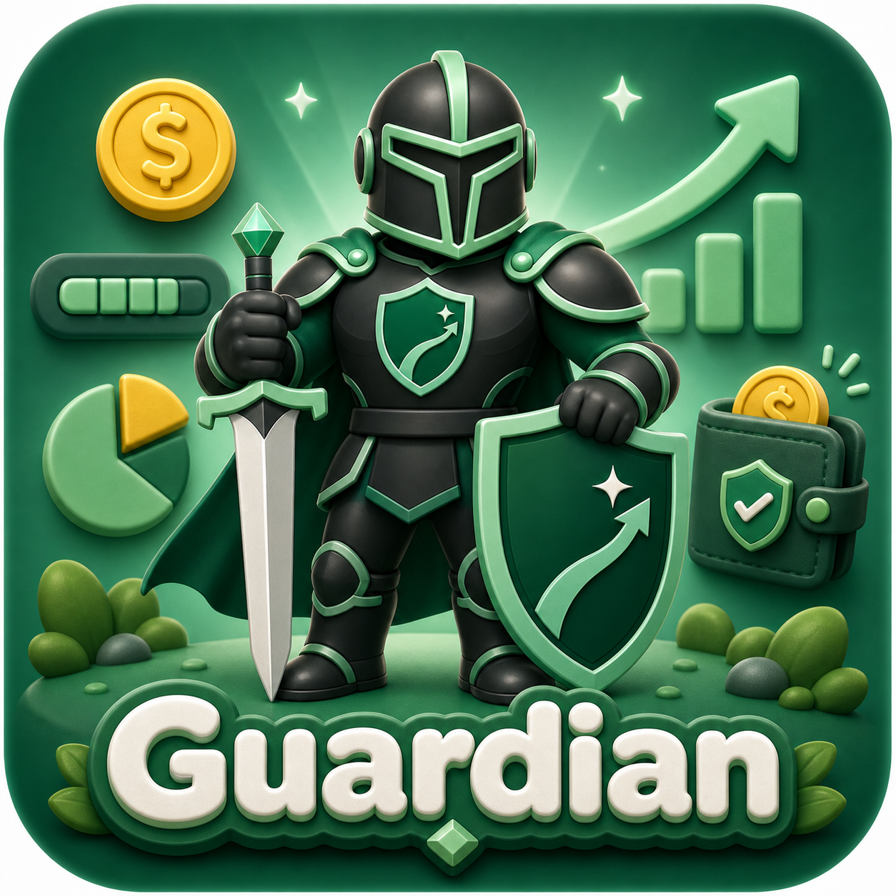
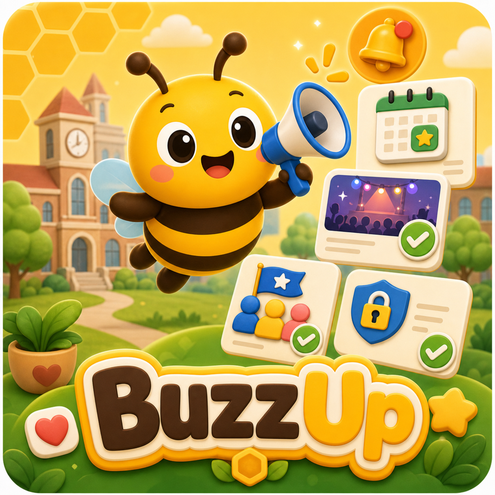
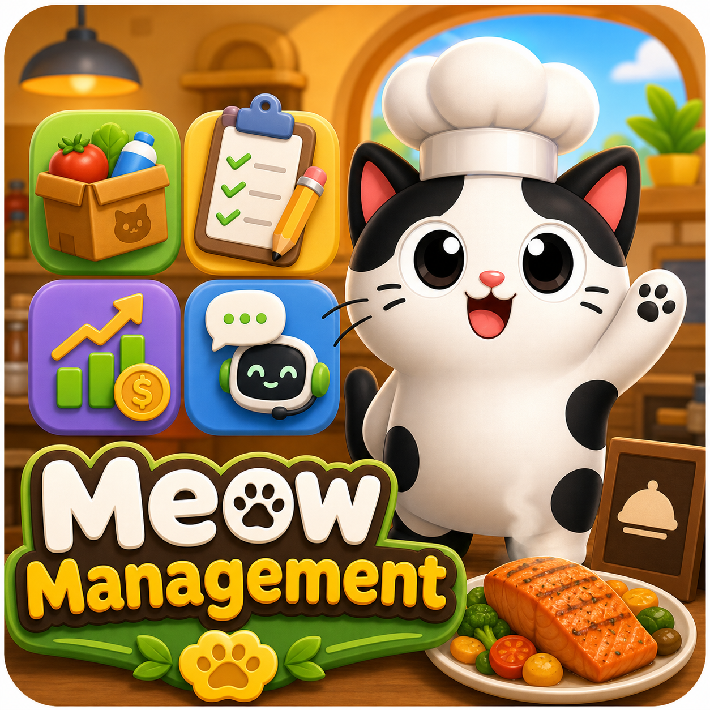
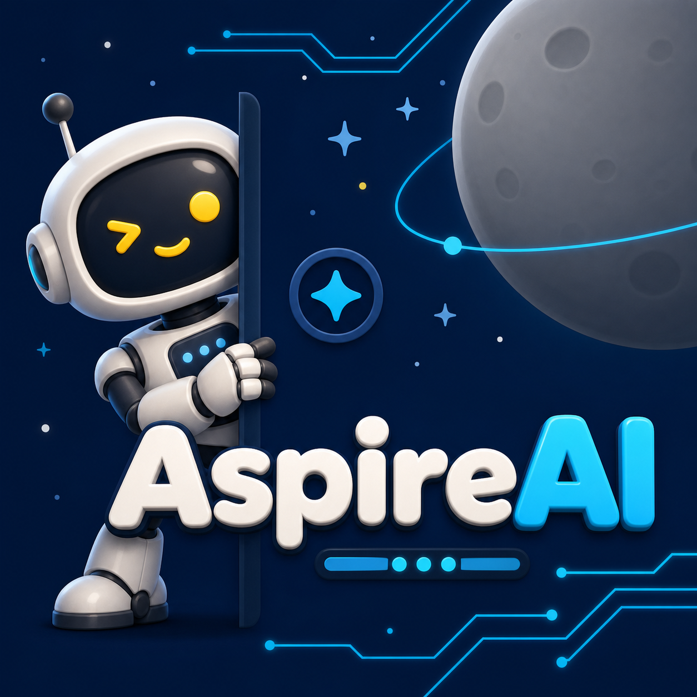
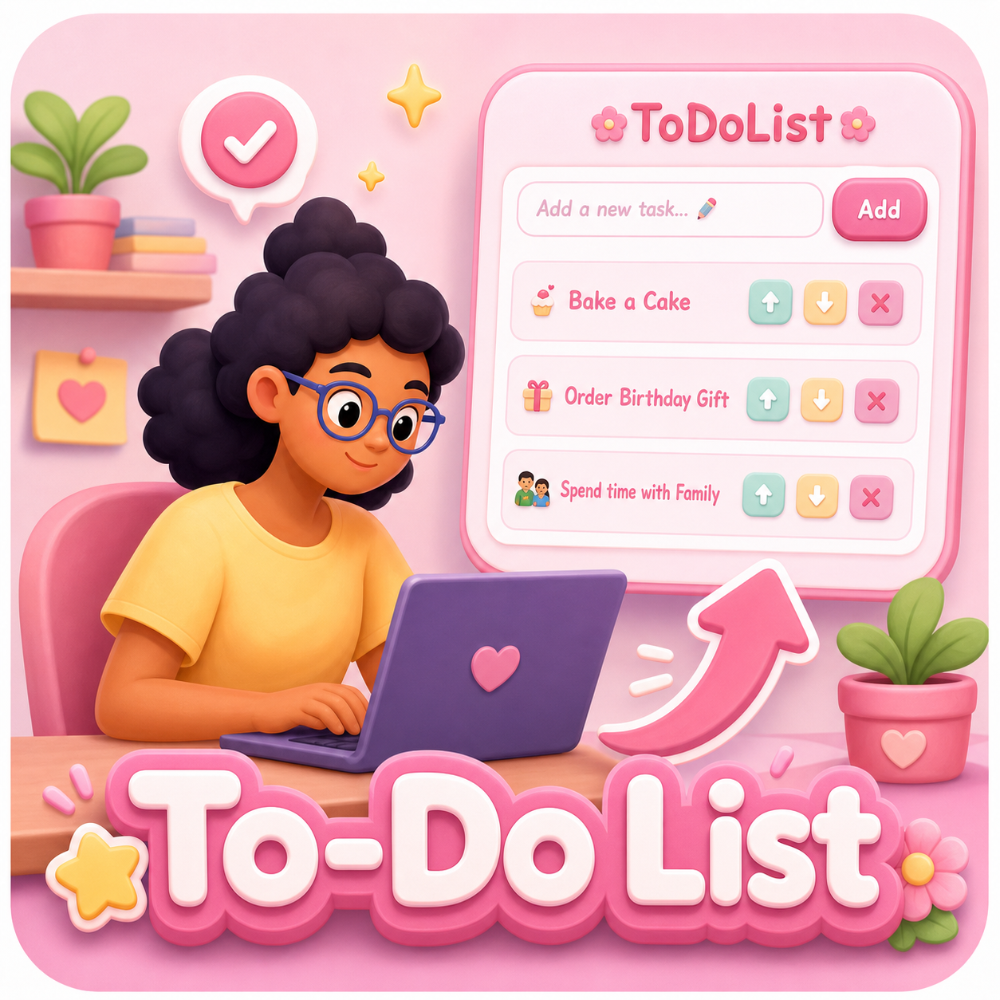

  

<h1 align="center">👋 Hi, I'm Kenyang Lual</h1>

  Computer Science Student | Software Engineering Intern | Full-Stack and Mobile Developer

  <a href="./documents/kenyang-lual-resume.pdf">Resume</a> |
  <a href="https://github.com/Kenyang1">GitHub</a> |
  <a href="https://www.linkedin.com/in/kenyanglual/">LinkedIn</a> |
  <a href="mailto:kenyanglual05@gmail.com">Email</a>

  

> 🚀 I build approachable technology that helps people discover, organize, and understand what matters to them.

## 👨🏿‍💻 About Me

I am a first-generation African American student pursuing a Bachelor of Science in Computer Science at Southern New Hampshire University. I enjoy turning ideas into approachable software experiences, especially mobile applications, responsive web products, and tools that solve real problems for students and everyday users.

My goal is to use technology to create a more connected and useful future. I am inspired by the idea of becoming a modern-day Iron Man: someone who combines creativity, engineering, and curiosity to build meaningful things.

Outside of software development, I play piano, guitar, and drums. Music gives me another way to experiment, create, and keep learning.

## 🎓 Education

### Southern New Hampshire University

**Bachelor of Science in Computer Science**  
2023 - 2027 | Manchester, New Hampshire

## 💼 Experience

### Software Engineering Intern - Fidelity Investments

**June 2026 - Present | Merrimack, New Hampshire**

Developing a Trusted Contact Person feature for Fidelity's investing app using Angular, Ionic, and NgRx Signal Store. My work includes integrating gRPC API calls, validating customer contact data end to end, and applying Fidelity's design system across new consumer-facing screens.

### Software Engineering Intern - Fidelity Investments

**June 2025 - August 2025 | Merrimack, New Hampshire**

Delivered redesigned Discovery Page and Sidebar Menu experiences using Angular, Ionic, and NgRx. The work improved page-load performance, reduced UI bugs by 40%, and introduced reusable services and components across Fidelity's mobile application libraries.

## 🧰 Technical Skills

**Languages:** TypeScript, JavaScript, Java, Python, C, C++, C#, HTML, CSS

**Frameworks and Libraries:** Angular, Ionic, NgRx, React Native, Expo, Next.js, React, Tailwind CSS

**Data and Tools:** Firebase, Supabase, PostgreSQL, Git

## 🚀 Featured Projects

<table>
  <tr>
    <td width="50%" valign="top">
      
      <h3>🛡️ Guardian</h3>
      
A responsive personal-finance app that makes monthly budgets easier to manage with safe-to-spend insights, transaction categorization, and trusted read-only sharing.

      
<strong>React Native, Expo, TypeScript, Firebase, Zod</strong>

      <a href="https://github.com/Kenyang1/guardian-app">View Project</a>
    </td>
    <td width="50%" valign="top">
      
      <h3>🐝 BuzzUp</h3>
      
A cross-platform campus-events app for discovering clubs, browsing events, managing RSVPs, and receiving notifications when new events are posted.

      
<strong>React Native, Expo, TypeScript, Supabase, Firebase</strong>

      <a href="https://github.com/3lenavan/Campus-event-notifier-app">View Project</a>
    </td>
  </tr>
  <tr>
    <td width="50%" valign="top">
      
      <h3>🐱 Meow Management</h3>
      
A chatbot-based restaurant operations app for managing inventory, operational notes, finances, and low-stock alerts from one mobile dashboard.

      
<strong>React Native, Expo, Supabase, Firebase</strong>

      <a href="https://github.com/Kenyang1/resturant-management-app">View Project</a>
    </td>
    <td width="50%" valign="top">
      
      <h3>🎯 AspireAI</h3>
      
An AI-powered career discovery tool that helps users explore paths that match their goals and interests.

      
<strong>Next.js, JavaScript, AI</strong>

      <a href="https://aspire-ai-rho.vercel.app/auth/signup">Live Demo</a> |
      <a href="https://github.com/Kenyang1/aspireAI">Source Code</a>
    </td>
  </tr>
  <tr>
    <td width="50%" valign="top">
      
      <h3>📰 PulseWire</h3>
      
A branded news website focused on presenting stories through a clean and accessible web interface.

      
<strong>JavaScript, HTML, CSS</strong>

      <a href="https://github.com/Kenyang1/news-website">View Project</a>
    </td>
    <td width="50%" valign="top">
      
      <h3>✅ To-Do List Application</h3>
      
A playful and responsive task-management application with a clean interface and an approachable visual style.

      
<strong>React, JavaScript, CSS</strong>

      <a href="https://official-to-do.vercel.app/">Live Demo</a> |
      <a href="https://github.com/Kenyang1/official-to-do">Source Code</a>
    </td>
  </tr>
</table>

## 🎮 More Projects

<strong>✨ Open the project vault</strong>

- ⚡ **[Pokedex](https://github.com/Kenyang1/pokedex):** A JavaScript application for browsing Pokemon details. [Live Demo](https://pokedex-one-blue.vercel.app/)
- 🏀 **[Sports Management Project](https://github.com/Kenyang1/Sports-Management-Project):** A web application for managing sports teams and events.
- 🛒 **[Grocery Tracking Program](https://github.com/Kenyang1/Grocery-Tracking-Program):** A C++ application for tracking grocery inventory and expenses.
- 👾 **[PacMan Game](https://github.com/Kenyang1/PacMan):** A Java implementation of PacMan using foundational game mechanics.
- 👽 **[Arduino Alien Communication Device](https://github.com/Kenyang1/Arduino-Alien-Communication-Device):** A hardware project built with Arduino and C++.
- 🏃 **[WebFitness](https://github.com/Kenyang1/WebFitness):** A C# and .NET fitness tracker for monitoring daily activities.

## 📬 Let's Connect

I am always interested in learning from other developers, discussing new ideas, and exploring opportunities to build useful technology.

- 📧 **Email:** [kenyanglual05@gmail.com](mailto:kenyanglual05@gmail.com)
- 💼 **LinkedIn:** [linkedin.com/in/kenyanglual](https://www.linkedin.com/in/kenyanglual/)
- 💻 **GitHub:** [github.com/Kenyang1](https://github.com/Kenyang1)
- 📄 **Resume:** [View my resume](./documents/kenyang-lual-resume.pdf)

<strong>Thanks for stopping by! ✨</strong>

